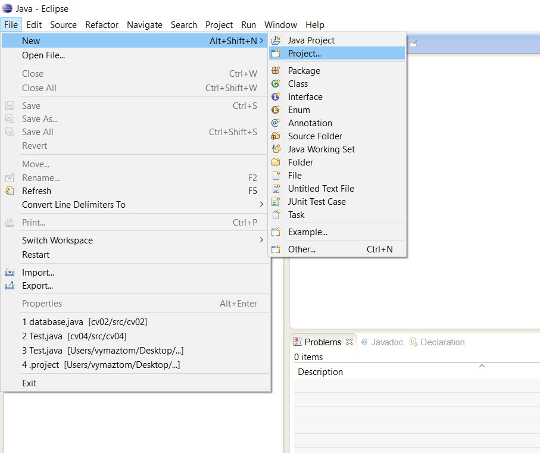
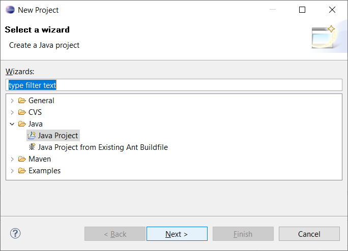
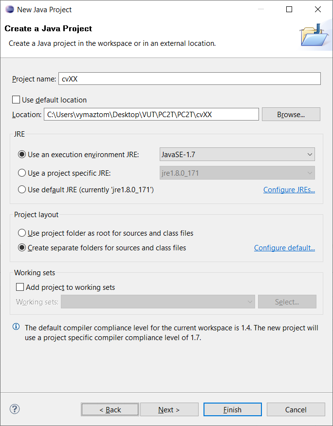
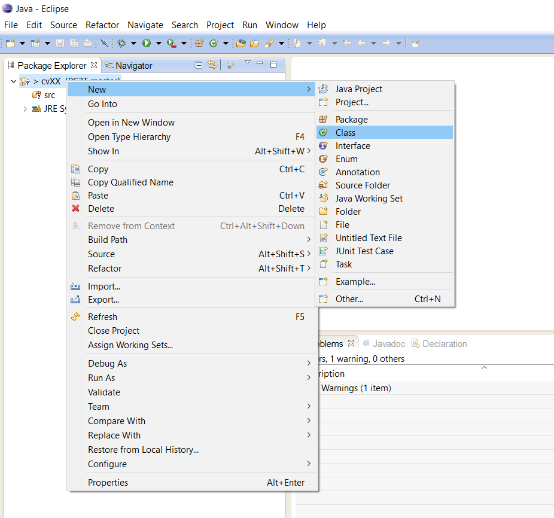
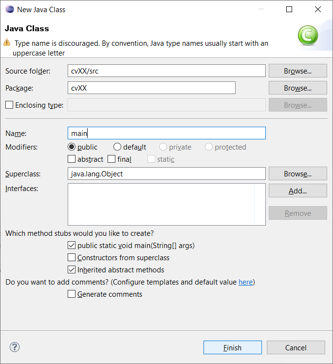
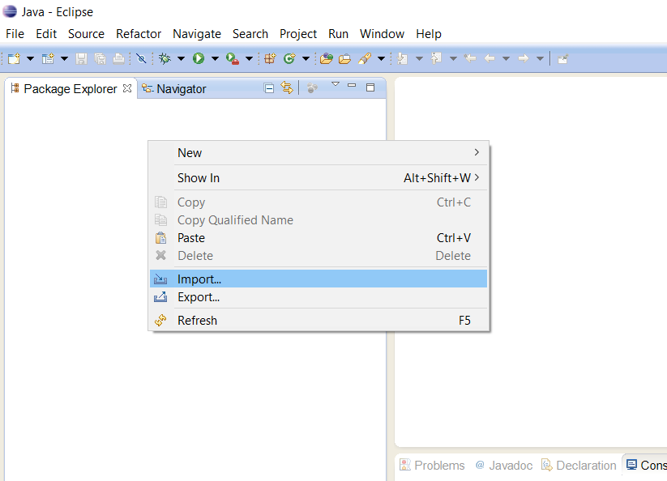
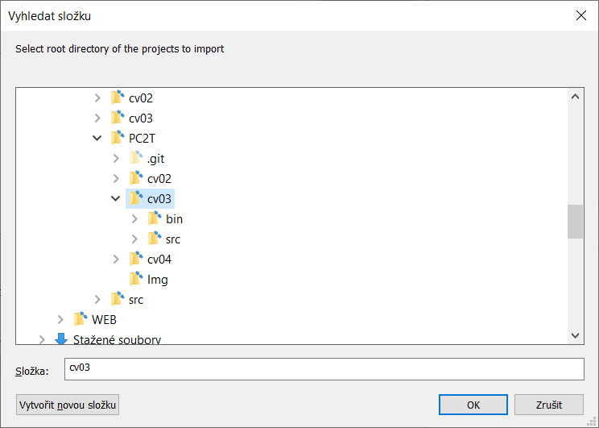
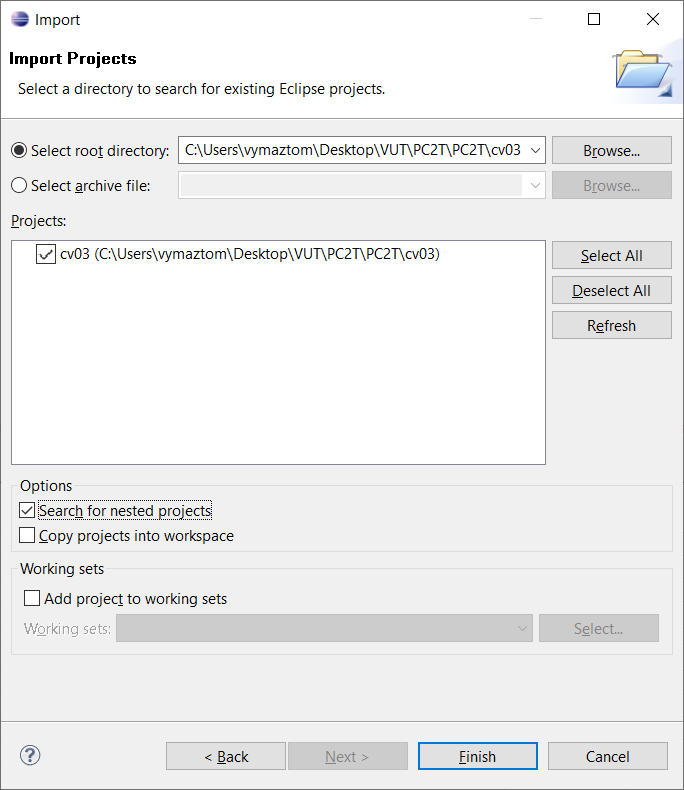

# VUT, FEKT, BPC-PC2T
- Subject about objective programing in Java, [School surce page](https://moodle.vutbr.cz/course/view.php?id=210737)
- Project created by using [Eclipse](https://www.eclipse.org/)    

### Lectures

|**N. of lesson**|**Date**|**Activity**|
|:-:|:-:|:-:|
|1|4.2.2020|[Codecademy tutorials](https://www.codecademy.com/)|
|2|11.2.2020|[Database of users, Classes](https://github.com/vymaztom/PC2T/tree/master/cv02)|
|3|18.2.2020|[Statistic of subjects, Interfaces](https://github.com/vymaztom/PC2T/tree/master/cv03)|
|4|25.2.2020|[Evidence of Goods, extend](https://github.com/vymaztom/PC2T/tree/master/cv04)|
|1|4.2.2020|[Codecademy tutorials](../vc02)|
|2|11.2.2020|Database of users, Classes|
|3|18.2.2020|Statistic of subjects, Interfaces|
|4|25.2.2020|Evidence of Goods, extend|
|5|3.3.2020||
|6|10.3.2020||
|7|17.3.2020||
|8|24.3.2020||
|9|31.3.2020||
|10|7.4.2020||
|11|14.4.2020||
|12|21.4.2020||
|13|18.4.2020||

### How to create new Project Eclipse
&nbsp;
1. Step

&nbsp;
2. Step

&nbsp;
3. Step

&nbsp;
4. Step

&nbsp;
5. Step

&nbsp;
6. Step - Submit and start programing :D
&nbsp;

### How to import project into Eclipse

&nbsp;
1. Step

&nbsp;
2. Step

&nbsp;
3. Step

&nbsp;
4. Step

&nbsp;
